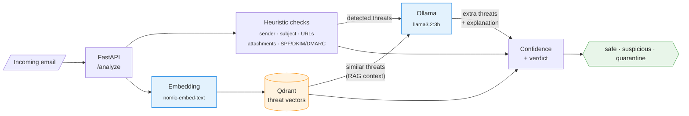

# Email Security RAG System

Local, open-source email threat detection system using RAG (Retrieval Augmented Generation) with Ollama and Qdrant.

## Architecture



### How the Components Work Together

When an email arrives for analysis, the system follows this pipeline:

1. **FastAPI** receives the email and runs fast rule-based heuristic checks
2. **Embeddings** convert the email text into a numerical representation
3. **Qdrant** searches for previously known threats that look similar to this email
4. **LLM** reads the email along with the matched threats and heuristic findings, then reasons about whether the email is dangerous
5. **FastAPI** combines all results and returns a final verdict (safe / suspicious / quarantine)

This is a **RAG (Retrieval Augmented Generation)** architecture: the system _retrieves_ relevant threat intelligence from its database and uses it to _augment_ the context given to the LLM, producing more accurate _generation_ of threat assessments than the LLM alone could provide.

---

### LLM - Large Language Model (Ollama / llama3.2:3b)

**In plain terms:** The LLM is the "brain" of the system. It reads the email the same way a human security analyst would and uses its understanding of language to spot threats that simple rules would miss -- subtle phishing language, social engineering tactics, or business email compromise attempts where someone impersonates an executive. It also writes the human-readable explanation included in every analysis result.

**Technical detail:**

The system uses Ollama to host the `llama3.2:3b` model locally. During analysis, the `EmailAnalyzer._llm_analyze()` method constructs a prompt that includes:

- The full email content (sender, recipients, subject, body, attachments)
- A summary of threats already detected by heuristic rules
- RAG context: descriptions of similar known threat patterns retrieved from Qdrant

The prompt instructs the model to return structured JSON containing any additional threats it identifies and an overall explanation. The request is made via HTTP POST to Ollama's `/api/generate` endpoint with `"format": "json"` to enforce structured output.

```
Email → Prompt Construction → Ollama /api/generate → JSON Parse → Additional Threats
```

The LLM catches threats that rule-based systems cannot, such as context-dependent social engineering, nuanced impersonation, or novel phishing patterns not yet in the threat database. Running locally via Ollama means no email content leaves the network.

| Detail | Value |
|--------|-------|
| Runtime | Ollama (local) |
| Model | `llama3.2:3b` (configurable via `LLM_MODEL`) |
| API endpoint | `POST {OLLAMA_HOST}/api/generate` |
| Output format | Structured JSON |
| Code | `api/services/analyzer.py` - `_llm_analyze()` |

---

### Embeddings (Ollama / nomic-embed-text)

**In plain terms:** Embeddings translate an email's text into a list of numbers (a "vector") that captures its meaning. Two emails about the same topic will produce similar number sequences even if they use different words. This is what allows the system to say "this email looks like a known phishing pattern" without needing an exact keyword match -- it compares meaning, not just words.

**Technical detail:**

The `EmbeddingService` calls Ollama's `/api/embed` endpoint using the `nomic-embed-text` model. Before embedding, the email is flattened into a single text string:

```
From: {sender}
To: {recipients}
Subject: {subject}
Body: {body}
Attachments: {filenames}
```

This text is converted into a **768-dimensional float vector**. The embedding model has been trained to place semantically similar text close together in this vector space (measured by cosine similarity). For example, "Your account has been suspended, verify now" and "We detected unusual login activity, confirm your identity" would produce vectors that are close together, even though they share few exact words.

Embeddings are generated at two points:
- **Seeding:** Each threat pattern in the database is embedded when first loaded into Qdrant
- **Analysis:** Each incoming email is embedded so it can be compared against stored patterns

| Detail | Value |
|--------|-------|
| Runtime | Ollama (local) |
| Model | `nomic-embed-text` (configurable via `EMBEDDING_MODEL`) |
| API endpoint | `POST {OLLAMA_HOST}/api/embed` |
| Vector dimensions | 768 |
| Distance metric | Cosine similarity |
| Code | `api/services/embeddings.py` |

---

### Vector Database (Qdrant)

**In plain terms:** Qdrant is the system's threat intelligence memory. It stores known threat patterns (phishing templates, suspicious domains, social engineering tactics) and can instantly find which stored patterns are most similar to a new email. Think of it as a library where instead of searching by title or author, you search by meaning -- "find me threats that look like this email."

**Technical detail:**

Qdrant stores threat patterns as points in a 768-dimensional vector space (matching the embedding model output). Each point contains:

- **Vector:** The 768-dimensional embedding of the threat pattern text
- **Payload:** Metadata including threat type, description, severity score, indicators, and example texts

The `RAGService` manages the Qdrant collection (`email_threats`) and provides two key operations:

1. **`search_similar_threats(embedding, limit=5, score_threshold=0.65)`** -- performs approximate nearest neighbour (ANN) search using cosine distance to find stored threats similar to the incoming email. Only results above the 0.65 similarity threshold are returned. These appear in the API response as `similar_threats`.

2. **`get_threat_context(embedding, limit=3)`** -- retrieves the top 3 matching patterns and formats their descriptions, indicators, and examples into a text block that is injected into the LLM prompt as RAG context.

The database is seeded from JSON files in `data/seed/`:
- `phishing_patterns.json` -- credential harvesting, account suspension, invoice fraud templates
- `suspicious_domains.json` -- known malicious domain patterns
- `social_engineering.json` -- authority, urgency, and reward-based manipulation tactics

| Detail | Value |
|--------|-------|
| Database | Qdrant |
| Collection | `email_threats` (configurable via `QDRANT_COLLECTION`) |
| Vector size | 768 |
| Distance metric | Cosine |
| Similarity threshold | 0.65 |
| Default port | 6333 |
| Code | `api/services/rag.py` |
| Seed data | `data/seed/*.json`, loaded by `scripts/seed_qdrant.py` |

---

### FastAPI (REST API / Orchestrator)

**In plain terms:** FastAPI is the front door and coordinator. It receives emails from external systems via a REST API, runs the entire analysis pipeline in the right order, and returns a structured result. It also performs fast rule-based checks (like flagging `.exe` attachments or failed email authentication) that don't require AI at all, handling the obvious cases quickly before engaging the more resource-intensive LLM.

**Technical detail:**

FastAPI serves as both the HTTP interface and the orchestration layer. The main endpoint `POST /api/v1/analyze` triggers a multi-stage pipeline inside `EmailAnalyzer.analyze_email()`:

1. **Heuristic analysis** (rule-based, no AI required):
   - Sender domain checks: lookalike/typosquatting detection, suspicious TLD flagging
   - Subject line scanning: urgency keywords, credential harvesting phrases
   - Body URL analysis: IP addresses in URLs, URL shorteners, suspicious paths
   - Attachment checks: dangerous extensions (`.exe`, `.scr`), double extensions (`.pdf.exe`)
   - Header verification: SPF/DKIM/DMARC failure detection, Reply-To mismatch

2. **Embedding generation:** converts the email to a 768-dim vector via the embedding service

3. **RAG retrieval:** queries Qdrant for similar known threats (used for both the response and LLM context)

4. **LLM analysis:** passes the email, heuristic findings, and RAG context to the LLM for deeper reasoning

5. **Verdict determination:** aggregates all threat signals and applies threshold logic:
   - Any malware threat with confidence >= 0.8 triggers immediate quarantine
   - Overall confidence >= `QUARANTINE_THRESHOLD` (default 0.8) returns `quarantine`
   - Overall confidence >= `SUSPICIOUS_THRESHOLD` (default 0.5) returns `suspicious`
   - Below threshold returns `safe`

Additional endpoints:
- `GET /health` -- reports connectivity to Ollama and Qdrant and confirms models are loaded
- `GET /api/v1/stats` -- returns threat pattern counts from the Qdrant collection

| Detail | Value |
|--------|-------|
| Framework | FastAPI (async Python) |
| Default port | 8000 (configurable via `API_PORT`) |
| Main endpoint | `POST /api/v1/analyze` |
| Code | `api/main.py` (routes), `api/services/analyzer.py` (pipeline) |
| Data models | `api/models.py` (Pydantic request/response schemas) |

## Prerequisites

- Docker and Docker Compose
- ~4GB disk space for models
- 8GB+ RAM recommended

## Quick Start

### 1. Start Services

```bash
cd email-security
docker-compose up -d
```

First run will download models (~2GB). Monitor progress:

```bash
docker-compose logs -f ollama-pull
```

### 2. Check Health

Wait for all services to be healthy:

```bash
docker-compose ps
```

Or check the API:

```bash
curl http://localhost:8000/health
```

Expected response when ready:
```json
{
  "status": "healthy",
  "ollama_connected": true,
  "qdrant_connected": true,
  "models_loaded": ["nomic-embed-text", "llama3.2:3b"]
}
```

### 3. Seed Threat Database (First Run)

```bash
docker-compose run --rm seed
```

Verify patterns loaded:

```bash
curl http://localhost:8000/api/v1/stats
```

## Testing

### Test a Safe Email

```bash
curl -X POST http://localhost:8000/api/v1/analyze \
  -H "Content-Type: application/json" \
  -d '{
    "from": "colleague@company.com",
    "to": ["you@company.com"],
    "subject": "Meeting notes from today",
    "body": "Hi,\n\nHere are the notes from our meeting.\n\nBest,\nJohn",
    "headers": {"Authentication-Results": "spf=pass; dkim=pass"},
    "attachments": []
  }'
```

Expected: `"verdict": "safe"`

### Test a Phishing Email

```bash
curl -X POST http://localhost:8000/api/v1/analyze \
  -H "Content-Type: application/json" \
  -d '{
    "from": "security@paypa1-verify.xyz",
    "to": ["victim@company.com"],
    "subject": "URGENT: Your account has been suspended - Verify immediately",
    "body": "Dear Valued Customer,\n\nWe have detected unusual activity on your PayPal account.\n\nVerify your identity immediately:\nhttp://192.168.1.100/paypal/verify?user=victim@company.com\n\nPayPal Security Team",
    "headers": {"Authentication-Results": "spf=fail; dkim=fail", "Reply-To": "scammer@gmail.com"},
    "attachments": []
  }'
```

Expected: `"verdict": "quarantine"` with threats like:
- Lookalike domain (paypa1)
- Suspicious TLD (.xyz)
- Urgency keywords
- IP address in URL
- SPF/DKIM failure

### Test a Malware Email

```bash
curl -X POST http://localhost:8000/api/v1/analyze \
  -H "Content-Type: application/json" \
  -d '{
    "from": "invoices@supplier.com",
    "to": ["accounts@company.com"],
    "subject": "Invoice #12345",
    "body": "Please find attached invoice for payment.",
    "headers": {},
    "attachments": [{"filename": "Invoice.pdf.exe", "content_type": "application/octet-stream"}]
  }'
```

Expected: `"verdict": "quarantine"` with malware indicator for double extension

### Test a BEC (Business Email Compromise)

```bash
curl -X POST http://localhost:8000/api/v1/analyze \
  -H "Content-Type: application/json" \
  -d '{
    "from": "ceo@company-corp.com",
    "to": ["finance@company.com"],
    "subject": "Urgent - Wire Transfer Needed",
    "body": "I need you to process an urgent wire transfer of $45,000.\n\nThis is confidential. Do not discuss with anyone.\n\nThanks,\nCEO",
    "headers": {"Reply-To": "ceo.smith@gmail.com"},
    "attachments": []
  }'
```

Expected: `"verdict": "suspicious"` or `"quarantine"`

### Run Integration Tests

```bash
python tests/test_api.py
```

## API Reference

### POST /api/v1/analyze

Analyze an email for threats.

**Request:**
```json
{
  "from": "sender@example.com",
  "to": ["recipient@example.com"],
  "cc": [],
  "bcc": [],
  "subject": "Email subject",
  "body": "Email body text",
  "body_html": "<html>...</html>",
  "headers": {
    "Authentication-Results": "spf=pass; dkim=pass",
    "Reply-To": "reply@example.com"
  },
  "attachments": [
    {
      "filename": "document.pdf",
      "content_type": "application/pdf",
      "size": 12345
    }
  ]
}
```

**Response:**
```json
{
  "verdict": "safe|suspicious|quarantine",
  "confidence": 0.92,
  "threats_detected": [
    {
      "threat_type": "phishing|malware|spoofing|bec|spam|social_engineering",
      "indicator": "Description of the threat",
      "confidence": 0.8,
      "details": "Additional details"
    }
  ],
  "similar_threats": [
    {
      "threat_id": "phish-001",
      "similarity_score": 0.85,
      "description": "Known threat description",
      "threat_type": "phishing"
    }
  ],
  "explanation": "Analysis summary",
  "processing_time_ms": 1234.56
}
```

### GET /health

Check service health.

### GET /api/v1/stats

Get threat database statistics.

## Threat Detection

The system detects:

| Threat Type | Indicators |
|-------------|------------|
| **Phishing** | Urgency keywords, credential harvesting, suspicious URLs, URL shorteners |
| **Spoofing** | Typosquatting domains, SPF/DKIM/DMARC failures, Reply-To mismatch |
| **Malware** | Dangerous file extensions (.exe, .scr), double extensions |
| **BEC** | Executive impersonation, wire transfer requests, confidentiality pressure |
| **Social Engineering** | Authority tactics, fear/urgency, reward bait |

## Configuration

Environment variables (see `.env.example`):

| Variable | Default | Description |
|----------|---------|-------------|
| `OLLAMA_HOST` | `http://ollama:11434` | Ollama server URL |
| `LLM_MODEL` | `llama3.2:3b` | LLM model for analysis |
| `EMBEDDING_MODEL` | `nomic-embed-text` | Embedding model |
| `QDRANT_HOST` | `qdrant` | Qdrant server host |
| `QUARANTINE_THRESHOLD` | `0.8` | Confidence threshold for quarantine |
| `SUSPICIOUS_THRESHOLD` | `0.5` | Confidence threshold for suspicious |

## Stopping

```bash
docker-compose down
```

To remove all data (models, vectors):

```bash
docker-compose down -v
```

## Troubleshooting

### Models not loading

Check ollama-pull logs:
```bash
docker-compose logs ollama-pull
```

Pull manually:
```bash
docker exec -it email-security-ollama ollama pull llama3.2:3b
docker exec -it email-security-ollama ollama pull nomic-embed-text
```

### API unhealthy

Check API logs:
```bash
docker-compose logs api
```

### Slow analysis

First request loads the model into memory (~30-60s). Subsequent requests are faster.
